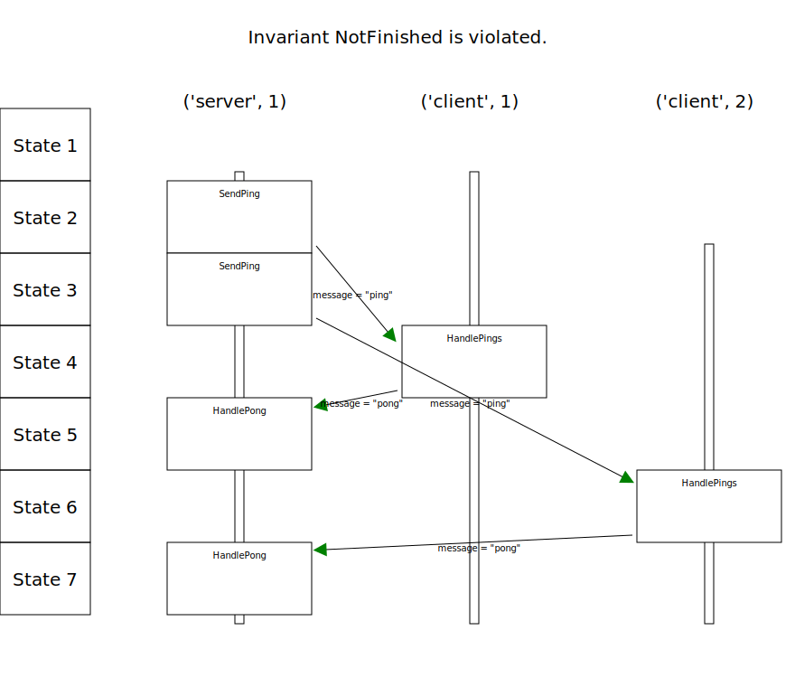

# tla-sequence-diagram

This is a tool for generating sequence diagrams from
[TLC](https://github.com/tlaplus/tlaplus/) state traces. It produces
SVGs that look like:

or [like this PDF](doc/sequence.pdf).

This tool is licensed under the [MIT license](LICENSE.MIT).

Copyright: Erkki Seppälä <erkki.seppala@vincit.fi> 2022

You can contact me also [via
Matrix](https://matrix.to/#/@flux:matrix.org).

## What is TLA+?

TLA+ (Temporal Logic of Actions+) is a way to describe the behavior of
an algorithm or a system at a high, yet in a very mathematically
precise manner. This allows one to reason about the system behavior in
a more accurate way than with a textual description of system
behavior. Combined with the tool TLC (Temporal Logic Checker) to do
checks with those models it increase the confidence of getting the
design right from the beginning—or later on finding corner cases in
the design that had not been detected by rigorous testing or code
reviews.

You can learn more about TLA+ at [the TLA+ home
page](http://lamport.azurewebsites.net/tla/tla.html). There's even [a
book](http://lamport.azurewebsites.net/tla/book.html?back-link=learning.html#book)!

## So what is this tool then?

When using TLC and an invariant you have set up for it fails, you end
up with a state dump. Sometimes this state dump can become unwieldly
or at least very slow to to analyze. This tool aims to help analyzing
certain kind of systems: the ones that are composed of individual
nodes exchanging messages with each other.

It achieves this by converting translated state traces into something
that's very close to standard sequence diagrams. The only difference I
see compared to standard sequence diagrams is that the message sending
and reception are decoupled in the diagram: messages will be received
sometimes much later than when they've been sent, and other behaviour
can be interleaved during that time. I'm not sure if the standard
diagrams would also be able to express this, though, but if this is
the case then perhaps a lot of this SVG rendering code would be
needles :).

Currently this tool is limited to exchanging messages with one central
system as this has currently been my need for it, but I expect in the
future exchanging messages arbitrarily among the nodes will also be
supported. It also doesn't try to avoid overlapping labels or lines
with other objects yet, but this is also something I'm planning to
implement at some point.

## Trying out the example

1) clone the repository, `cd` to it
2) `pip install drawSvg`
3) `cd examples`
4) run `../check.sh pingpong -messages` to get `sequence.svg`

If you have [Inkscape](https://inkscape.org) installed, you will also
get the PDF file `sequence.pdf`. If you have
[llpp](https://repo.or.cz/w/llpp.git) installed, you will find it has
been sent a `SIGHUP` and maybe the diagram you have already open will
be refreshed.

[`check.sh`](check.sh) will use TLC to check the model using the
configuration [pingpong.cfg](examples/pingpong.cfg), except it will
add `ALIAS AliasMessage` to it. The `ALIAS` is defined in the
[`pingpong.tla`](pingpong.tla) so that it produces output in the form
the tool currently expects it at.

## Theory of operation

At each state (in the dump) there is JSON value with the key
`messages_json`, which contains all the pending messages between
server and the clients. Currently the tool assumes there is a central
server all want to exchange messages with, as there is no way to
indicate which server a client is interacting with. There are two
kinds of channels in the example: ones from the server to the clients
and ones from the clients to the server.

Once a message appears in a channel (e.g. the channel is `busy`), it
is considered to be sent by the tool. Once a message disappears (no
longer `busy`) from the channel, it is considered to have been
received by the peer.
